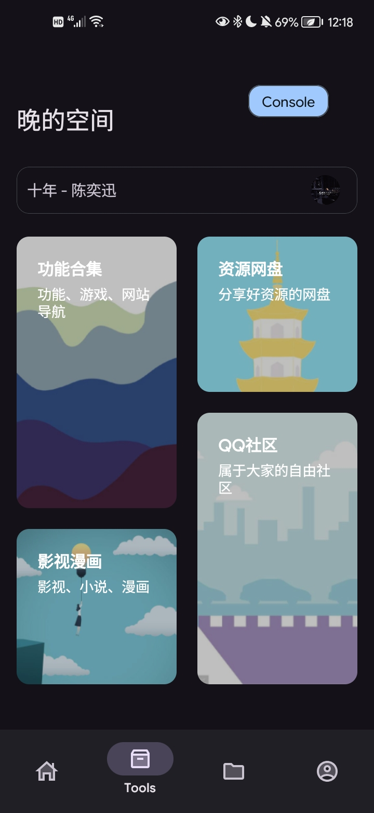
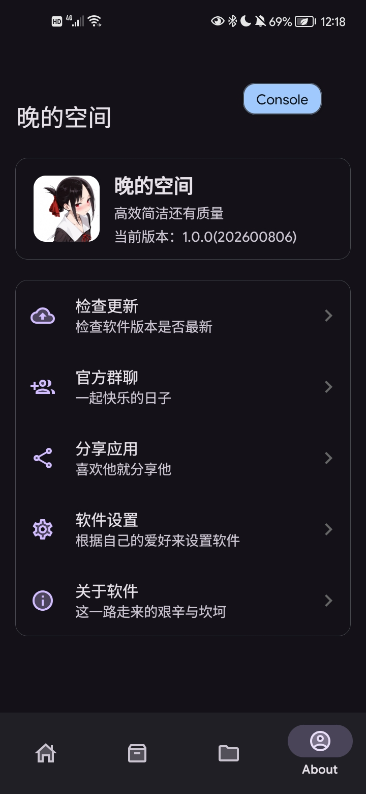

  
  <h1>晚的空间 · wan-Space</h1>
  
<strong>高效 · 简洁 · 还有质量</strong>

  
一个集功能工具、网站发现、资源导航与自由社区于一体的数字空间。

  

    
    
    
  

---

## 软件简介

晚的空间（wan-Space）是一款面向 Android 平台的数字工具箱，集功能工具、网站发现、资源导航与自由社区于一体。应用坚持“高效、简洁、还有质量”的设计原则，为用户提供清晰、顺手、可持续扩展的使用体验。

> “我只想多见你一次，多和你说一句话。”
> 晚的空间，欢迎每一个晚归的你。

---

## 界面预览

| 首页 Home | 工具 Tools |
| :---: | :---: |
|  |  |

| 收藏 Star | 关于 About |
| :---: | :---: |
|  |  |

---

## 核心功能

### 首页 Home

- 每日一言：每日更新一句内容，提供轻量阅读入口。
- 网页发现：收录有趣、实用的网站，拓展发现入口。
- 日常工具：整合常用功能，提供快捷访问。
- 更多功能持续开发中。

### 工具 Tools

- 功能合集：功能、游戏、网站集中直达。
- 导航：按影视、小说、漫画等分类整理。
- 资源网盘：集中分享优质资源。
- QQ 社区：提供自由交流的社区入口。

### 收藏 Star

- 支持一键收藏常用工具。
- 可随时浏览、管理与再次访问。

### 关于 About

- 版本信息：`1.0.1 (20260925)`
- 检查更新
- 官方群聊
- 分享应用
- 软件设置

---

## 版本信息

| 项目 | 说明 |
| :--- | :--- |
| 当前版本 | `1.0.1 (20260925)` |
| 软件口号 | 高效 · 简洁 · 还有质量 |
| 应用类型 | 工具箱软件 |
| 适配平台 | Android |

---

## 规划中

- [ ] 更多功能研发中
- [ ] 用户系统与云端收藏
- [ ] 更多实用工具上线

---

## 更新日志

### v1.0.1 (20260925)

- 首个正式版本发布。
- 上线首页、工具、收藏、关于四大板块。
- 基于 VitePress 构建官网，并完成响应式适配。

---

## 加入我们

- 官方群聊：欢迎加入交流与反馈。
- 分享应用：把晚的空间分享给更多人。
- GitHub 仓库：[wan0705/Wan-Space](https://github.com/wan0705/Wan-Space/)

**晚的空间，高效、简洁、还有质量。**

愿每一个夜晚，都有你的驻足。

---

## 赞助我
[爱发电链接](https://afdian.com/a/wan_official)

